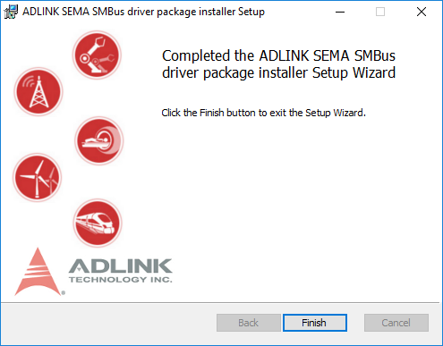

### How to install SEMA on Windows & Linux

### Windows 10 64bit

Please go to [windows sema reposioty]()  to download the Installer which contains:

* SEMA EAPI and SMBus Driver
* Command Line Interface Application

Running the installwe which will be automatically installed SMBus driver, EAPI library and command line utility.

1. After download, please execute the installer file and click "Next" button

2. Click "Next" Button to start to install

3. Until you see "Finish" button for the successful installation.

4. You can see the installed files/folders under "**c:\Program Files\Adlink**":
   * **Appliction** folder: includes EAPI.dll, EAPI.lib, semauti.exe, exmple codes.
   * **SEMA_SMBus_4** folder: includes Windows SMBus drivers (sys, inf files)

 

### Linux
  TBD
