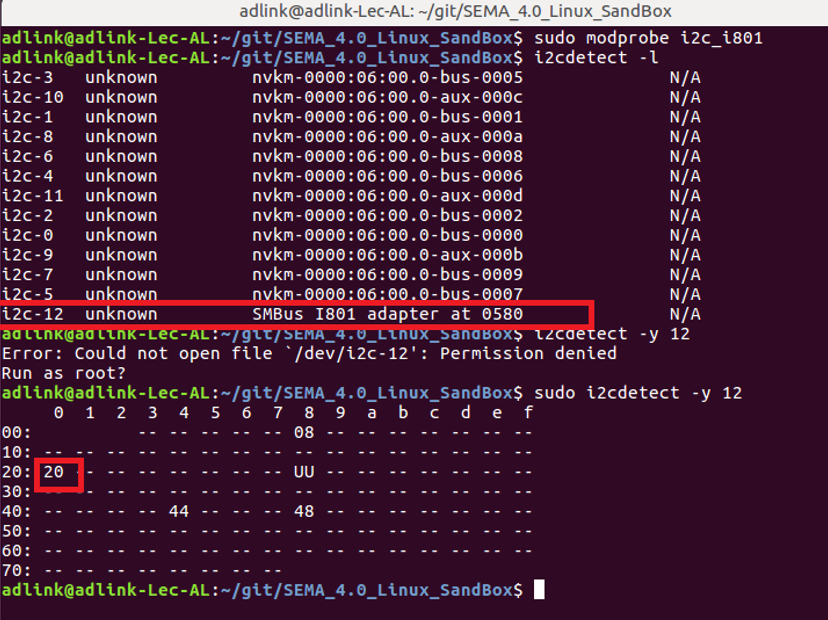

### How to install on Windows & Linux


* [Windows 10 64Bit](source/HowToInstallSEMA.md#windows-10-64bit)
* [Ubuntu Linux](source/HowToInstallSEMA.md#ubuntu-linux)


<br> 

### Windows 10 64Bit

Please go to [here](https://hq0epm0west0us0storage.blob.core.windows.net/public/SEMA%204.0.0_20200215.rar)  to download the Installer which contains:

* SEMA EAPI and SMBus Driver
* Command Line Interface Application

Running the installer which will be automatically installed SMBus driver, EAPI library and command line utility.

1. After download, please execute the installer file and click "Next" button

    


2. Click "Next" Button to start to install 

    

3. Until you see "Finish" button for the successful installation

    

4. You can see the installed files/folders under "**c:\Program Files\Adlink**"

  * **Application** folder: includes EAPI.dll, EAPI.lib, semauti.exe, example codes.
  * **SEMA_SMBus_4** folder: includes Windows SMBus drivers (sys, inf files)

<br />

<br>

### Ubuntu Linux


Follow below instructions to build and install the SEMA utility on target machine.

#### Prerequisites

Install build-essential package to install all tools used along with make. Install git, hexer and i2c-tools.

```
sudo apt install build-essential git hexer i2c-tools
```

#### Build and Install

1. Download the source code from ADLINK git repository

```
git clone https://github.com/ADLINK/sema-linux.git
```

2. Change directory to sema-linux and run make.

```
cd sema-linux
```

3. Run make

```
sudo make
```

4. To install driver modules, dynamic library and utilities into root file system

```
sudo make install
```

5. To remove  i2c-i801 driver in the blacklist and make it automatically loaded

```
sudo vim /etc/modprobe.d/blacklist.conf
```

   please comment **#blacklist i2c_i801** as the below:


6. To load all of drivers

```
sudo modprobe -a adl-bmc adl-bmc-boardinfo adl-bmc-vm adl-bmc-wdt adl-bmc-hwmon adl-bmc-nvmem adl-bmc-bklight adl-bmc-i2c gpio-pca953x
```

   **Note:** after installed, these files will be located at the following path

| File       | Description                                            |
| ---------- | ------------------------------------------------------ |
| libsema.so | EAPI Library is located under `/usr/lib/`              |
| semautil   | SEMA Command Line utility is located under `/usr/bin/` |


7. After loading kernel driver, configure the GPIO device with the following command.

```
echo pca9535 0x20 > /sys/bus/i2c/devices/i2c-12/new_device
```

**Note**: here i2c-12 is used, since SMBus is located at bus 12. `0x20` is GPIO device slave address. Please refer the below screenshot to know the i2c bus number and GPIO device address.



