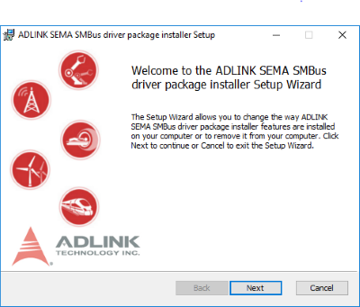
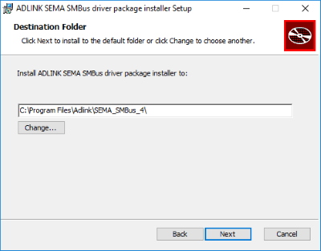
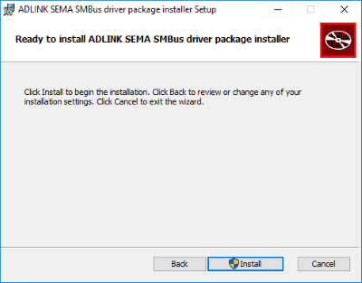

### How to install SEMA on Windows & Linux

### Windows 10 64bit

Please go to [here](https://hq0epm0west0us0storage.blob.core.windows.net/public/SEMA%204.0.0_20200215.rar)  to download the Installer which contains:

* SEMA EAPI and SMBus Driver
* Command Line Interface Application

Running the installwe which will be automatically installed SMBus driver, EAPI library and command line utility.

1. After download, please execute the installer file and click "Next" button

    


2. Click "Next" Button to start to install 

    

3. Until you see "Finish" button for the successful installation

    

4. You can see the installed files/folders under "**c:\Program Files\Adlink**"

  * **Appliction** folder: includes EAPI.dll, EAPI.lib, semauti.exe, exmple codes.
  * **SEMA_SMBus_4** folder: includes Windows SMBus drivers (sys, inf files)

<br />

### Linux


Follow below instructions to build and install the SEMA utility on target machine.

#### Prerequisites

Install build-essential package to install all tools used along with make. Install git, hexer and i2c-tools.

```
sudo apt install build-essential git hexer i2c-tools
```

#### Build and Install

Download the source code from ADLINK git repository

```
git clone https://github.com/ADLINK/sema-linux.git
```

Change directory to sema-linux and run make.

```
cd sema-linux
sudo make
```

To install driver modules, dynamic library and utilities into root file system.

```
sudo make install
```

