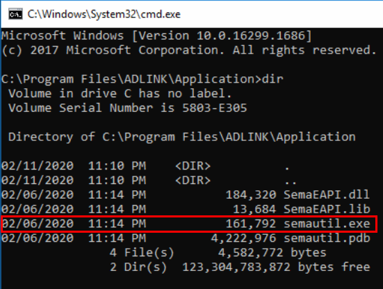
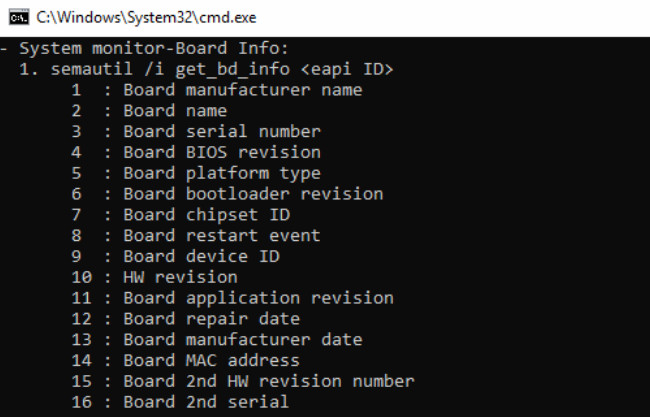
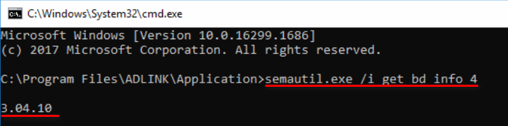
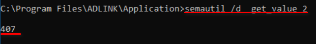
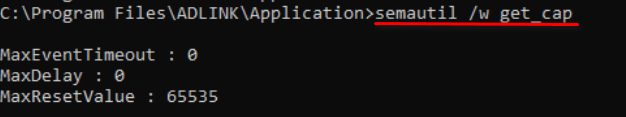

### How to use SEMA Utility

1. After installed Windows SEMA 4.0 (please refer to here to gude you how to install). please open **Command Prompt** and go to this path:**C:\Windows\System32\cmd.exe** to execute SEMA utility.

2. please use **semautil.exe -h** to make you understand how more easily to use.

   #### Here is some examples:

   * BIOS version:  Enter the command: **semautil.exe /i get_bd_info 4** on Command Prompt Window
     

   * Boot counter: Enter the command: **semautil.exe /d get_value 2**
     

   * Watchdog capability :  Enter the command: **semautil.exe /w get_cap** on Command Prompt Window
     
