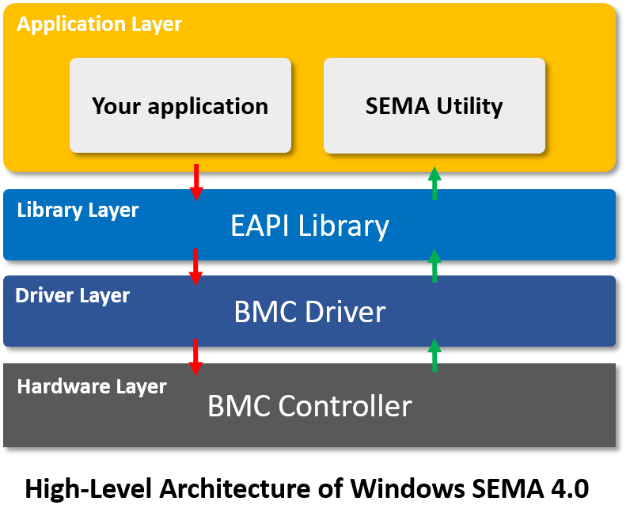
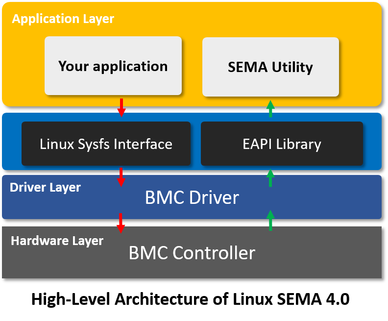

   
   

  ## What is SEMA?

  **The Smart Embedded Management Agent (SEMA®)**

  Downtime of devices or systems is not acceptable in today's industries. To help customers to analyze their
  systems and take counter measures for preventive maintenance, ADLINK Technology Inc. has developed a tool which is able to monitor and collect system performance and status information from the hardware in a timely, flexible and precise manner. A Board Management Controller collects all relevant technical information from the chipset and other sources.

  Using the System Management Bus driver, an application layer fetches the data and presents it to the user.
  SEMA® provides a ready-made application that shows the data in user-friendly graphic interfaces, suitable
  for supervision and troubleshooting.

  

  

  

  ## Architecture Overview

  This describes the different designs on WIndows & Linux.

|               Windows SEMA 4.0                |              Linux SEMA 4.0  (TBD)              |
| :-------------------------------------------: | :---------------------------------------------: |
|  |  |

  

  * For Windows SEMA 4.0:
    To add SemaEAPI.dll into your application to access the function. please check SEMA utility as the 	   example code for your reference.
    **Note:** The souce code of SEMA utility & EAPI is located at GitHub. Please contact us if you would like 	            the codes of BMC SMBus driver.

  

  * For Linux SEMA 4.0:
    It provides two methods to access BMC :
    1. EAPI Library:  
       With the introduction of the COM Express specification a software interface (available free of charge at https://www.picmg.org/wp-content/uploads/COM_EAPI_R1_0.pdf) was created.  

    2. Sysfs Interface:
       With the exposure of Sysfs interface, it can be easier and straightforward to access.
       **Note:** All of source code on Linux includes BMC driver, EAPI library, and utility is located at GitHub.

  

  

  Features
  ----------

  SEMA® is designed to be:

  * Power Consumption
  * User Area Access
  * I2C Control
  * Temperatures (CPU and Board)
  * Board Information (Serial Number, Part Number, Firmware Version...)
  * Fan Control
  * GPIO Control
  * Watch Dog  

  

  Detailed forensic information is available after system or module failures. The BMC Power-Up Error Log function provides detailed information about history of failures that may have occurred during power-up sequences. Log information includes e.g. error number, flags, restart event, power cycles, boot count, status, CPU temperature and board temperature. Moreover minimum and maximum temperature of the CPU and system is available to analyze system or module failure in detail.

  

  

  

  Support Operating System
  --------------------------

  * **Windows OS**: Windows 10 64bit
  * **Linux OS**: TBD (Provide by end of Feb. 2020)
  * **Yocto Linux**: TBD (Provide by end of Feb. 2020)
  * **VxWorks (by request)**
  * **QNX (by request)**
