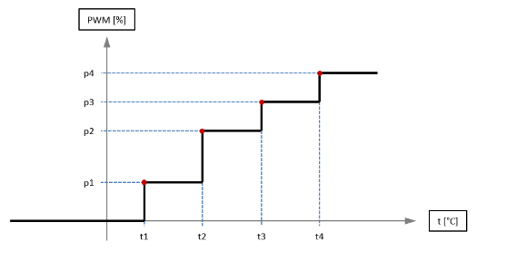
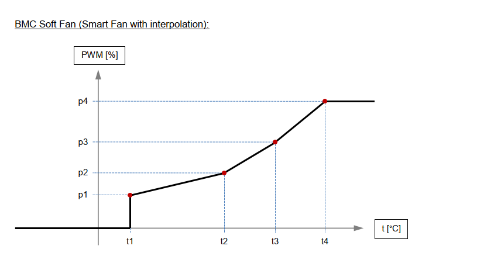
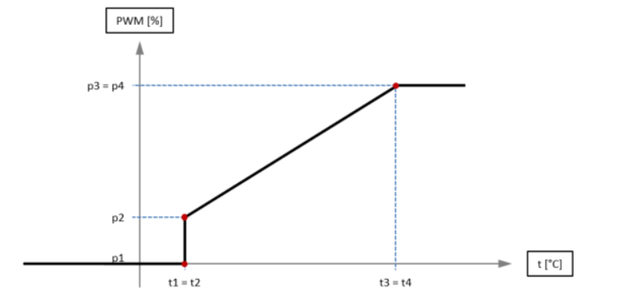

### Smart Fan Control

Supports to control the smart fan. For each fan, four temperature thresholds can be configured with corresponding fan power levels which are applied when the threshold is exceeded.

Also provide two different operations to control PWM speed:

* Operation of SMART FAN Mode:  

  please use **EApiSmartFanSetMode** function with `SEMA_FAN_MODE_AUTO` parameter and provides 4 levels of temerpature & 4 levels of PWM are configured to get the below ladder chart:

  For example:

  |             | Level 1  | Level 2  | Level 3  | level 4  |
| ----------- | -------- | -------- | -------- | -------- |
  | Temperature | 30℃ (t1) | 40℃ (t2) | 50℃ (t3) | 80℃ (t4) |
  | PWM         | 40 (p1)  | 50 (p2)  | 60 (p3)  | 100 (p4) |
  
   

  ​                                      	
  
* Operation of SOFT FAN Mode:

  Please use BMC capability command to check Bit 34 & Bit 39 to see whic design of SOFT FAN are using on your platform.

  | Bit 34 | Bit 39 | FAN Mode               | Type                                                         |
  | ------ | ------ | ---------------------- | ------------------------------------------------------------ |
  | 0      | 1      | SEMA_FAN_MODE_SOFT_FAN | 4 level of temperature & PWM as the below linear **chart 1** |
  | 1      | 0      | SEMA_FAN_MODE_AUTO     | 2 level of temperature & PWM as the below linear **chart 2** |
  | 0      | 0      | Not support            | Not support                                                  |
  | 1      | 1      | Not support            | Not support                                                  |

  1. Linear chart 1 with 4 level of temperature & PWM configuration:
  
    For example,
  
  |             | Level 1  | Level 2  | Level 3  | level 4  |
| ----------- | -------- | -------- | -------- | -------- |
| Temperature | 30℃ (t1) | 40℃ (t2) | 50℃ (t3) | 80℃ (t4) |
 PWM         | 40 (p1)  | 50 (p2)  | 60 (p3)  | 100 (p4) |
      
      

  2. Linear chart 2 with 2 level of temperature & PWM configuration:
  
    For exmple:  **(The Rule is  t1 = t2; t3 = t4; p3 = p4)**
  
  |             | Level 1      | Level 2      | Level 3      | level 4     |
| ----------- | ------------ | ------------ | ------------ | ------------ |
  | Temperature | **30℃ (t1)** | **30℃ (t2)** | **75℃ (t3)** | **75℃ (t4)** |
  | PWM         | 0 (p1)       | 30 (p2)      | **100 (p3)** | **100 (p4)** |
  
    

<br />


#### List of Sys Interface 


Based on platform (LEC-AL, cExpress-WL, etc) device name (hwmonX) will change. To confirm the device name which is created by our driver, check the **/sys/bus/platform/devices/adl-bmc-fan/hwmon/** path**.**

Ex: $ ls /sys/bus/platform/devices/adl-bmc-fan/hwmon/

Output**: hwmon2**     

In the above example our device is hwmon2, so need to replace hwmonX in below commands with hwmon2

* To set temperature set points (1-4)         

  ```
  echo {temperature} > /sys/class/hwmon/hwmonX/device/pwm_auto_point_temp
  ```

   In the example below, the user is setting temperature of set point 1 and Fan ID as 1 (SEMA_EAPI_ID_FAN_CPU) with temperature as 10
  
   echo 10 > /sys/class/hwmon/hwmon2/device/pwm1_auto_point1_temp
   
   echo 20 > /sys/class/hwmon/hwmon2/device/pwm1_auto_point2_temp
   
   echo 30 > /sys/class/hwmon/hwmon2/device/pwm1_auto_point3_temp
   
   echo 40 > /sys/class/hwmon/hwmon2/device/pwm1_auto_point4_temp


* To get temperature set points (1-4)

  ```
  cat /sys/class/hwmon/hwmonX/device/pwm_auto_point_temp
  ```

  In the example below, the user is getting temperature of set point 1 and fan ID 1 (SEMA_EAPI_ID_FAN_CPU) 

   cat /sys/class/hwmon/hwmon2/device/pwm1_auto_point1_temp
   cat /sys/class/hwmon/hwmon2/device/pwm1_auto_point2_temp
   
   cat /sys/class/hwmon/hwmon2/device/pwm1_auto_point3_temp
   
   cat /sys/class/hwmon/hwmon2/device/pwm1_auto_point4_temp


* To set PWM set points (1-4)

  ```
  echo {PWM value} > /sys/class/hwmon/hwmonX/device/pwm_auto_point_pwm
  ```

  In the example below, user is setting PWM value of set point 1 and fan ID 1 (SEMA_EAPI_ID_FAN_CPU) with PWM level as 10
  
  
  echo 10 > /sys/class/hwmon/hwmon2/device/pwm1_auto_point1_pwm
  
  echo 10 > /sys/class/hwmon/hwmon2/device/pwm1_auto_point2_pwm
  
  echo 10 > /sys/class/hwmon/hwmon2/device/pwm1_auto_point3_pwm
  
  echo 10 > /sys/class/hwmon/hwmon2/device/pwm1_auto_point4_pwm
  

* To get PWM set points (1-4)

  ```
  cat /sys/class/hwmon/hwmonX/device/pwm_auto_point_pwm
  ```

  In the example below, user is getting PWM value of set point 2 and fan ID as 2 (SEMA_EAPI_ID_FAN_SYSTEM_1 )
  
  cat /sys/class/hwmon/hwmon2/device/pwm2_auto_point1_pwm
  
  cat /sys/class/hwmon/hwmon2/device/pwm2_auto_point2_pwm
  
  cat /sys/class/hwmon/hwmon2/device/pwm2_auto_point3_pwm
  
  cat /sys/class/hwmon/hwmon2/device/pwm2_auto_point4_pwm


*  The configration of Fan Mode:

  | Fan Mode               | Value |
  | ---------------------- | ----- |
  | SEMA_FAN_AUTO          | 0     |
  | SEMA_FAN_OFF           | 1     |
  | SEMA_FAN_ON            | 2     |
  | SEMA_FAN_AUTO_SOFT_FAN | 3     |

  * To set fan mode

    ```
    echo {FAN Mode value} > /sys/class/hwmon/hwmonX/device/pwm1_enable
    ```

    In the example below, user is setting fan mode as 1

    echo 1 > /sys/class/hwmon/hwmon2/device/pwm1_enable

  * To get fan mode

    ```
    cat /sys/class/hwmon/hwmon2/device/pwm1_enable
    ```
  
  
  
* The configration of temperature source

  | Temperature sources | Value |
  | ------------------- | ----- |
  | CPU Temperature     | 0     |
  | Board Temperature   | 1     |

   * To set temperature source

       ```
       echo {temperature source value} /sys/class/hwmon/hwmonX/device/pwm1_auto_channels_temp 
       ```

       In the example below, user is setting temperature source as 1 (Board temperature)

       echo 1 > /sys/class/hwmon/hwmon2/device/pwm1_auto_channels_temp

* To get temperature source:
    ``` 
    cat /sys/class/hwmon/hwmon2/device/pwm1_auto_channels_temp  
    ``` 
* To get CPU current temperature
  
    ```
    cat /sys/class/hwmon/hwmonX/device/cpu_cur_temp
    ```

* To get CPU minimum temperature
    ``` 
    cat /sys/class/hwmon/hwmonX/device/cpu_min_temp
    ```
* To get CPU maximum temperature
    ``` 
    cat /sys/class/hwmon/hwmonX/device/cpu_max_temp
    ``` 
* To get CPU startup temperature
    ``` 
    cat /sys/class/hwmon/hwmonX/device/cpu_startup_temp
    ``` 
* To get system1 current temperature
    ```   
    cat /sys/class/hwmon/hwmonX/device/sys1_cur_temp
    ``` 
* To get system1 minimum temperature
    ```
    cat /sys/class/hwmon/hwmonX/device/sys1_min_temp
    ```
  
* To get system1 maximum temperature
    ```
    cat /sys/class/hwmon/hwmonX/device/sys1_max_temp 
    ```

* To get system1 startup temperature.
    ```
    cat /sys/class/hwmon/hwmonX/device/sys1_startup_temp 
    ```

* To get system2 current temperature
    ```
    cat /sys/class/hwmon/hwmonX/device/sys2_cur_temp 
    ```
  
* To get system2 minimum temperature.
    ```
    cat /sys/class/hwmon/hwmonX/device/sys2_min_temp 
    ```
  
* To get system2 maximum temperature.
    ```
    cat /sys/class/hwmon/hwmonX/device/sys2_max_temp 
    ```
  
* To get system2 startup temperature.
    ```
    cat /sys/class/hwmon/hwmonX/device/sys2_startup_temp 
    ```

* To get CPU fan speed.
    ```
    cat /sys/class/hwmon/hwmonX/device/cpu_fan_speed 
    ```

* To get system1 fan speed.
    ```
    cat /sys/class/hwmon/hwmonX/device/sys1_fan_speed 
    ```

* To get system2 fan speed.
    ```
    cat /sys/class/hwmon/hwmonX/device/sys2_fan_speed 
    ```

* To get system3 fan speed.
    ```
    cat /sys/class/hwmon/hwmonX/device/sys3_fan_speed
    ```


<br />


#### List of SEMA EAPI (Support Windows & Linux)


```
uint32_t uint32_t EApiSmartFanSetTempSetpoints(
        uint32_t FanID, 
        uint32_t Level1, 
        uint32_t Level2,
        uint32_t Level3,
        uint32_t Level4
)
```

**Description**

Set temperature levels ( variable type is signed integer / Degree Celsius)

* Parameters:

  * uint32_t FanID:

    Select FAN ID as the parameter

    | ID                        | Description   |
    | ------------------------- | ------------- |
    | SEMA_EAPI_ID_FAN_CPU      | CPU Fan       |
    | SEMA_EAPI_ID_FAN_SYSTEM_1 | System Fan #1 |
    | SEMA_EAPI_ID_FAN_SYSTEM_2 | System Fan #2 |
    | SEMA_EAPI_ID_FAN_SYSTEM_3 | System Fan #3 |

  * uint32_t Level1:

    ​		 Configure the first level of temperature (t1)

  * uint32_t Level2:

    ​		 Configure the second level of temperature (t2)

  * uint32_t Level3:

    ​		 Configure the third level of temperature (t3)

  * uint32_t Level4:

    ​		 Configure the fourth level of temperature (t4)

<br /> 

```
uint32_t uint32_t EApiSmartFanGetTempSetpoints(uint32_t FanId, uint32_t* pLevel1, uint32_t* pLevel2, uint32_t* pLevel3, uint32_t* pLevel4)
```

**Description**

Get temperature levels

* Parameters:

  * uint32_t FanID:

    Select FAN ID as the parameter

    | ID                        | Description   |
    | ------------------------- | ------------- |
    | SEMA_EAPI_ID_FAN_CPU      | CPU Fan       |
    | SEMA_EAPI_ID_FAN_SYSTEM_1 | System Fan #1 |
    | SEMA_EAPI_ID_FAN_SYSTEM_2 | System Fan #2 |
    | SEMA_EAPI_ID_FAN_SYSTEM_3 | System Fan #3 |

  * uint32_t* Level1:

    ​		 Pointer to a buffer that receives the current temperature level (t1)

  * uint32_t* Level2:

    ​		 Pointer to a buffer that receives the current temperature level (t2)

  * uint32_t* Level3:

    ​		 Pointer to a buffer that receives the current temperature level (t3)

  * uint32_t* Level4:

    ​		 Pointer to a buffer that receives the current temperature level (t4)

<br /> 

```
uint32_t uint32_t EApiSmartFanSetPWMSetpoints(
        uint32_t FanID, 
        uint32_t Level1, 
        uint32_t Level2, 
        uint32_t Level3,
        uint32_t Level4
)
```

**Description**

Set PWM levels ( Range is **0 ~100** )

* Parameters:

  * uint32_t FanID:

    Select FAN ID as the parameter

    | ID                        | Description   |
    | ------------------------- | ------------- |
    | SEMA_EAPI_ID_FAN_CPU      | CPU Fan       |
    | SEMA_EAPI_ID_FAN_SYSTEM_1 | System Fan #1 |
    | SEMA_EAPI_ID_FAN_SYSTEM_2 | System Fan #2 |
    | SEMA_EAPI_ID_FAN_SYSTEM_3 | System Fan #3 |

  * uint32_t Level1:

    ​		 Configure the first level of PWM (p1)

  * uint32_t Level2:

    ​		 Configure the second level of PWM (p2)

  * uint32_t Level3:

    ​		 Configure the third level of PWM (p3)

  * uint32_t Level4:

    ​		 Configure the fourth level of PWM (p4)


<br />

```
uint32_t uint32_t EApiSmartFanGetTempSetpoints(
        uint32_t FanId, 
        uint32_t* pLevel1, 
        uint32_t* pLevel2, 
        uint32_t* pLevel3, 
        uint32_t* pLevel4
)
```

**Description**

Get PWM levels ( Range is **0 ~100** )

* Parameters:

  * uint32_t FanID:

    Select FAN ID as the parameter

    | ID                        | Description   |
    | ------------------------- | ------------- |
    | SEMA_EAPI_ID_FAN_CPU      | CPU Fan       |
    | SEMA_EAPI_ID_FAN_SYSTEM_1 | System Fan #1 |
    | SEMA_EAPI_ID_FAN_SYSTEM_2 | System Fan #2 |
    | SEMA_EAPI_ID_FAN_SYSTEM_3 | System Fan #3 |

  * uint32_t* Level1:

    ​		 Pointer to a buffer that receives the current PWM level (p1)

  * uint32_t* Level2:

    ​		 Pointer to a buffer that receives the current PWM level (p2)

  * uint32_t* Level3:

    ​		 Pointer to a buffer that receives the current PWM level (p3)

  * uint32_t* Level4:

    ​		 Pointer to a buffer that receives the current PWM level (p4)

<br /> 

```
uint32_t uint32_t EApiSmartFanSetMode(uint32_t FanId, uint8_t pFanMode)
```

**Description**

Set FAN Mode

* Parameters:

  * uint32_t FanID:

    Select FAN ID as the parameter

    | ID                        | Description   |
    | ------------------------- | ------------- |
    | SEMA_EAPI_ID_FAN_CPU      | CPU Fan       |
    | SEMA_EAPI_ID_FAN_SYSTEM_1 | System Fan #1 |
    | SEMA_EAPI_ID_FAN_SYSTEM_2 | System Fan #2 |
    | SEMA_EAPI_ID_FAN_SYSTEM_3 | System Fan #3 |

  * uint32_t pFanMode:

     Select FAN mode as the parameter

    | FAN Mode               | Description                                                  |
    | ---------------------- | ------------------------------------------------------------ |
    | SEMA_FAN_MODE_ON       | Default speed is only refer to PWM level #4                  |
    | SEMA_FAN_MODE_OFF      | Turn Off FAN                                                 |
    | SEMA_FAN_MODE_AUTO     | it will be configured as "stepwise operation between Temperature and PWM" |
    | SEMA_FAN_MODE_SOFT_FAN | it will be configured as "Linear operation between Temperature and PWM" |


<br /> 

```
uint32_t uint32_t EApiSmartFanGetMode(uint32_t FanId, uint8_t* pFanMode)
```

**Description**

Get FAN Mode

* Parameters:

  * uint32_t FanID:

    Select FAN ID as the parameter

    | ID                        | Description   |
    | ------------------------- | ------------- |
    | SEMA_EAPI_ID_FAN_CPU      | CPU Fan       |
    | SEMA_EAPI_ID_FAN_SYSTEM_1 | System Fan #1 |
    | SEMA_EAPI_ID_FAN_SYSTEM_2 | System Fan #2 |
    | SEMA_EAPI_ID_FAN_SYSTEM_3 | System Fan #3 |

  * uint8_t* pFanMode:

     Pointer to a buffer that receives the current FAN mode

    | FAN Mode               | Description                                   |
    | ---------------------- | --------------------------------------------- |
    | SEMA_FAN_MODE_ON       | Default speed is only refer to PWM level #4   |
    | SEMA_FAN_MODE_OFF      | Turn Off FAN                                  |
    | SEMA_FAN_MODE_AUTO     | it will be configured as "stepwise operation" |
    | SEMA_FAN_MODE_SOFT_FAN | it will be configured as "Linear operation"   |


 <br />

```
uint32_t uint32_t EApiSmartFanGetTempSrc(uint32_t FanId, uint8_t* pTempSrc)
```

**Description**

Get the temperature source for the specified FAN ID. SMART FAN will be triggered by the temperature source. Only CPU and system temperature could be set as temperature source of FANs

* Parameters:

  * uint32_t FanID:

    Select FAN ID as the parameter

    | ID                        | Description   |
    | ------------------------- | ------------- |
    | SEMA_EAPI_ID_FAN_CPU      | CPU Fan       |
    | SEMA_EAPI_ID_FAN_SYSTEM_1 | System Fan #1 |
    | SEMA_EAPI_ID_FAN_SYSTEM_2 | System Fan #2 |
    | SEMA_EAPI_ID_FAN_SYSTEM_3 | System Fan #3 |

  * uint8_t* pTempSrc:

    Pointer to a buffer that receives the current tmperature source.

    | Temperature Source ID | Description                    |
    | --------------------- | ------------------------------ |
    | SEMA_FAN_TEMP_CPU     | Temperature source from CPU    |
    | SEMA_FAN_TEMP_SYS     | Temperature source from System |


 <br />

```
uint32_t uint32_t EApiSmartFanSetTempSrc(uint32_t FanId, uint8_t pTempSrc)
```

**Description**

Set the temperature source for the specified FAN ID. SMART FAN will be triggered by the temperature source. Only CPU and system temperature could be set as temperature source of FANs

* Parameters:

  * uint32_t FanID:

    Select FAN ID as the parameter

    | ID                        | Description   |
    | ------------------------- | ------------- |
    | SEMA_EAPI_ID_FAN_CPU      | CPU Fan       |
    | SEMA_EAPI_ID_FAN_SYSTEM_1 | System Fan #1 |
    | SEMA_EAPI_ID_FAN_SYSTEM_2 | System Fan #2 |
    | SEMA_EAPI_ID_FAN_SYSTEM_3 | System Fan #3 |

  * uint8_t pTempSrc:

     Select ID as the paramter

    | Temperature Source ID | Description                    |
    | --------------------- | ------------------------------ |
    | SEMA_FAN_TEMP_CPU     | Temperature source from CPU    |
    | SEMA_FAN_TEMP_SYS     | Temperature source from System |
