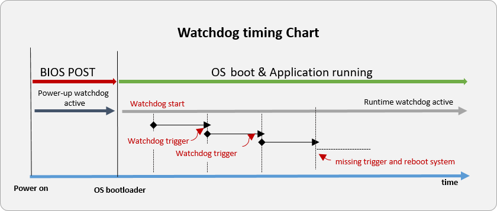

### WatchDog Control

Support two watchdog controls of the board. If the watchdog begins and reaches the pre-set time, it will access the CPU’s RESET signal to reset the system.




* **Run-Time Watchdog:** used in the OS to monitor the process or the application. BIOS also provides the capability to enable, disable and setup timeout value on BIOS Menu. If enable run-time watchdog on BIOS menu, please make a trigger to extend the timeout or system reboot.

  **Note:** timeout value will continuously keep until run-time watchdog is disabled on BIOS Menu or using SEMA functions to stop it.  


* **Power-up Watchdog:** used to supervise the boot process between system power-on to the operating system loading. When BIOS POST can be successfully booted, BIOS will clear power-up watchdog and go to OS bootloader. BIOS also provides the capability to enable, disable and setup timeout value on BIOS Menu.  

  **Note:** Reboot system is a must after using SEMA function to enable power-up watchdog.

<br />


#### List of Sys Interface 


##### For Run-time Watchdog: 

* To start/update the run-time watchdog with timeout out value, use the following format:
  ```
  wdogtest –timeout=<time in seconds>
  ```
  
  The example below sets the run-time watchdog timeout value as 20 seconds.
  ```
  wdogtest –timeout=20
  ```  
  
* To stop the run-time watchdog ( Timeout value will be set to '0'. Please set timeout again)
  ```
  echo "V" > /dev/watchdog0
  ```
  
* To trigger / ping the run-time watchdog
  ```
  wdogtest –ping
  ```
  
* To get the information about the run-time watchdog state
  ```
  cat /sys/class/watchdog/watchdog0/state
  ```
* To get the current run-time watchdog timeout value ( timeout value is not the elapsed time. it is your initial timeout)   
  ```
  cat /sys/class/watchdog/watchdog0/timeout
  ```
* To get minimum/maximum run-time watchdog timeout value
  ```
  /sys/bus/platform/devices/adl-bmc-wdt/Capabilities/wdt_min_timeout
  
  /sys/bus/platform/devices/adl-bmc-wdt/Capabilities/wdt_max_timeout
  ```
  
##### For Power-up Watchdog  

* To start / update the power-up watchdog timer value:
  ```
  echo <time in seconds> /sys/bus/platform/devices/adl-bmc-wdt/Capabilities/PwrUpWDog
  ```
  The example below sets the power-up watchdog timer timeout value as 1000 seconds.   
  
  echo 1000 > /sys/bus/platform/devices/adl-bmc-wdt/Capabilities/PwrUpWDog

* To get the power-up watchdog timer value
  ```
  cat /sys/bus/platform/devices/adl-bmc-wdt/Capabilities/PwrUpWDog
  ```

* To stop the power-up watchdog timer
  ```
  echo 0 > /sys/bus/platform/devices/adl-bmc-wdt/Capabilities/PwrUpWDog
  ```


<br />

#### List of SEMA EAPI (Support Windows & Linux)


  ```
uint32_t EApiWDogGetCap(
    uint32_t *pMaxDelay,
    uint32_t *pMaxEventTimeout,
    uint32_t* Resetvalue
)
  ```

**Description**

Get the capabilities of **run-time watchdog**

* Parameters:

  * uint32_t *pMaxDelay:

    Pointer to a buffer that receives maximum supported initial delay time of the watchdog timer in miliseconds.

  * uint32_t *pMaxEventTimeout:

    ​		Pointer to a buffer that receives maximum supported event timeout of the watchdog timer in miliseconds.

  * uint32_t* Resetvalue:

    ​		Pointer to a buffer that receives maximum supported event timeout of the watchdog timer in miliseconds.


```
uint32_t EApiWDogStart(
    uint32_t delay,
    uint32_t EventTimeout,
    uint32_t ResetTime
)
```

**Description**

Start to **run-time watchdog** timer. To reset timer value, timer must be stopeed by using **EApiWDogStop** and then **EApiWDogStart** be called again with new values.  

* Parameters:

  * uint32_t delay:

    ​		Initial delay for the watchdog timer in milliseconds. (currently not supported by SEMA EAPI, set  it as 0)

  * uint32_t EventTimeout:

    ​		Initial delay for the watchdog timer in milliseconds. (currently not supported by SEMA EAPI, set it as 0)

  * uint32_t ResetTime:

    ​		Watchdog timeout interval in milliseconds to trigger a reset.


<br />


```
uint32_t EApiWDogTrigger()
```

**Description**

reset the **run-time watchdog** timer

* Parameters: N/A


<br />


```
uint32_t EApiWDogStop()
```

**Description**

Stops the operation of the **run-time watchdog** timer

* Parameters: N/A


<br />


```
uint32_t EApiPwrUpWDogStart( uint32_t ResetTime)
```

**Description**

enable the operation of the **power-up watchdog timer**

* Parameters:

  * uint32_t ResetTime:

    Watchdog timeout interval in milliseconds to trigger a reset.


<br />


```
uint32_t EApiPwrUpWDogStop()
```

**Description**

Disable the operation of the **power-up watchdog** timer (disable)

* Parameters: N/A

```

```
