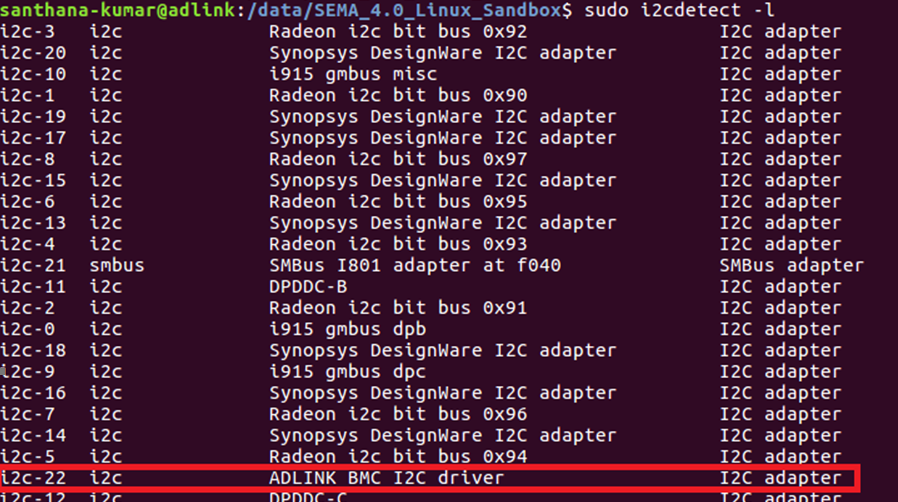

### I2C Control

Provide an interface to access I2C devices. Please refer to the Hardware User Manual to check how many I2C interfaces which supported on your produt

**Note:** Only available with Tiva BMC and can't be supported on Renesas BMC.


#### How to use in Linux

After adl-bmc-i2c driver loaded, please use `i2cdetect` command to look for **i2c-22**. Then, you can use Linux i2c commands to access your devices.




#### List of SEMA EAPI (Only for Windows)

```
uint32_t EApiI2CGetBusCap(uint32_t Id, uint32_t *pMaxBlkLen)
```

**Description**

Returns the capabilities of the selected I2C bus.

* Parameters:

  * uint32_t Id:

    Select i2c Bus ID as the first parameter

    | ID                   | Description             |
    | -------------------- | ----------------------- |
    | EAPI_ID_I2C_EXTERNAL | Baseboard I2C Interface |
    | EAPI_ID_I2C_LVDS_1   | LVDS/EDP 1 Interface    |

  * uint32_t *pMaxBlkLen:

    Size in bytes, pointer to a buffer that receives the maximum transfer block length for the given      interface. Note that care must be taken if used in combination withEapiI2CWriteTransfer as the maximum data payload length will be pMaxBlkLen (write overhead). For example, a 7-bit    	 	    addressed device with extended command has a write overhead of 2 bytes which are 		 		   	    command.


  **Note**: Max length of data byte to write is **29 Bytes**; Max length of data byte to read is **32 Bytes**


<br />
<br />

```
uint32_t EApiI2CProbeDevice(uint32_t Id, uint32_t Addr)
```

**Description**

Probes I2C address to test I2C Device present

* Parameters:

  * uint32_t Id:

    Select i2c Bus ID as the first parameter

    | ID                   | Description             |
    | -------------------- | ----------------------- |
    | EAPI_ID_I2C_EXTERNAL | Baseboard I2C Interface |
    | EAPI_ID_I2C_LVDS_1   | LVDS/EDP 1 Interface    |

  * uint32_t Addr:

    Encoded 7 bit I2C device address


 <br />


```
uint32_t EApiI2CGetBusSts(uint32_t Id, uint8_t *sts)
```

**Description**

Gets current status of the I2C bus.

* Parameters:

  * uint32_t Id:

    Select i2c Bus ID as the first parameter

    | ID                   | Description             |
    | -------------------- | ----------------------- |
    | EAPI_ID_I2C_EXTERNAL | Baseboard I2C Interface |
    | EAPI_ID_I2C_LVDS_1   | LVDS/EDP 1 Interface    |

  * uint8_t *sts:

    This describes the definition of I2C bus status:

    | Bit   | Description                                                  |
    | ----- | ------------------------------------------------------------ |
    | Bit 7 | I2C_MASTER_ERR_CLK_TOUT<br />     No Error = 0<br />     Clock Timeout Error = 1 |
    | Bit 6 | reserved                                                     |
    | Bit 5 | I2C Transaction timeout <br/>      - No error = 0<br/>   - Transaction timeout error = 1 |
    | Bit 4 | I2C_MASTER_ERR_ARB_LOST <br/>      - No error = 0<br/>      - Arbitration error = 1 |
    | Bit 3 | I2C_MASTER_ERR_DATA_ACK <br/>      - No error = 0<br/>      - Data acknowledge error = 1 |
    | Bit 2 | I2C_MASTER_ERR_ADDR_ACK <br/>      - No error = 0<br/>      - Address acknowledge error = 1 |
    | Bit 1 | I2C Transaction result <br/>       - Transaction ok = 0 <br/>     - No data send/received = 1 |
    | Bit 0 | I2C Bus status <br/>               - I2C transaction ongoing = 0  <br/>    - I2C bus is free = 1 |


 <br />

```
uint32_t EApiI2CReadTransfer(
        uint32_t Id,
        uint32_t Addr,
        uint32_t Cmd,
        void *pBuffer,
        uint32_t BufLen,
        uint32_t ByteCnt
)
```

**Description**

Reads from a specific register in the selected I2C device. Reads from I2C device at the I2C address Addr the amount of ByteCnt bytes to the buffer pBuffer while using the device specific command Cmd. Depending on the addressed I2C device Cmd can be a specific command or a byte offset.

* Parameters:

  * uint32_t Id:

    Select i2c Bus ID as the first parameter

    | ID                   | Description             |
    | -------------------- | ----------------------- |
    | EAPI_ID_I2C_EXTERNAL | Baseboard I2C Interface |
    | EAPI_ID_I2C_LVDS_1   | LVDS/EDP 1 Interface    |

  * uint32_t Addr:

    Encoded 7 Bit I2C Device Address.

  * uint32_t Cmd:

    Encoded I2C Device Command / Index.

  * void *pBuffer:

    Pointer to a buffer that receives the read data. This parameter can be NULL if the data is not 	required

  * uint32_t BufLen:

    Size, in bytes, of the buffer pointed to by the pBuffer parameter. If the buffer specified by 		    	       pBuffer parameter is not large enough to hold the data, the function returns the value 			               `EAPI_STATUS_MORE_DATA`

  * uint32_t ByteCnt:

    Size in bytes of data to be read


<br /> 


```
uint32_t EApiI2CWriteTransfer(
        uint32_t Id,
        uint32_t Addr,
        uint32_t Cmd,
        void *pBuffer,
        uint32_t ByteCnt
)
```

**Description**

Write to a specific register in the selected I2C device. Writes to an I2C device at the I2C address Addr the amount of ByteCnt bytes from the buffer *pBuffer while using the device specific command Cmd. Depending on the addressed I2C device Cmd can be a specific command or a byte offset.

* Parameters:

  * uint32_t Id:

    Select i2c Bus ID as the first parameter

    | ID                   | Description             |
    | -------------------- | ----------------------- |
    | EAPI_ID_I2C_EXTERNAL | Baseboard I2C Interface |
    | EAPI_ID_I2C_LVDS_1   | LVDS/EDP 1 Interface    |

  * uint32_t Addr:

    Encoded 7 Bit I2C Device Address.

  * uint32_t Cmd:

    Encoded I2C Device Command / Index.

  * void *pBuffer:

    Pointer to a buffer that receives the read data. This parameter can be NULL if the data is not 	required

  * uint32_t ByteCnt:

    Size, in bytes, of the information pointed to by the pBuffer parameter


 <br />

```
uint32_t EApiI2CWriteReadRaw(
        uint32_t Id,
        uint8_t Addr,
        void *pWBuffer,
        uint32_t WriteBCnt,
        void *pRBuffer,
        uint32_t RBufLen,
        uint32_t ReadBCnt
)
```

**Description**

Universal function for read and write operations to the I2C bus. Refer to PICMG EAPI 1.0

* Parameters:

  * uint32_t Id:

    Select i2c Bus ID as the first parameter

    | ID                   | Description             |
    | -------------------- | ----------------------- |
    | EAPI_ID_I2C_EXTERNAL | Baseboard I2C Interface |
    | EAPI_ID_I2C_LVDS_1   | LVDS/EDP 1 Interface    |

  * uint32_t Addr:

    Encoded 7 Bit I2C Device Address.

  * void *pWBuffer:

    Pointer to a buffer containing the data to be transferred. This parameter can be NULL if the data is not required

  * uint32_t WriteBCnt:

    Size, in bytes, of the information pointed to by the pWBuffer parameter plus 1 If pWBuffer is  		NULL this must be zero or one.

  * void *pRBuffer:

    Pointer to a buffer that receives the read data. This parameter can be NULL if the data is not     	     required.

  * uint32_t RBufLen:

    Size, in bytes, of the buffer pointed to by the pRBuffer parameter. If the buffer specified by 	           pRBuffer parameter is not large enough to hold the data, the function returns the value 		 		`EAPI_STATUS_MORE_DATA` If pRBuffer is NULL this must be zero.

  * uint32_t ReadBCnt:

    Size, in bytes, to be read to pRBuffer plus 1. If pRBuffer is NULL, this must be zero or one.
